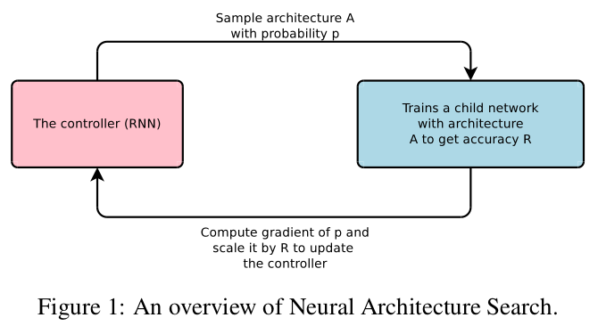
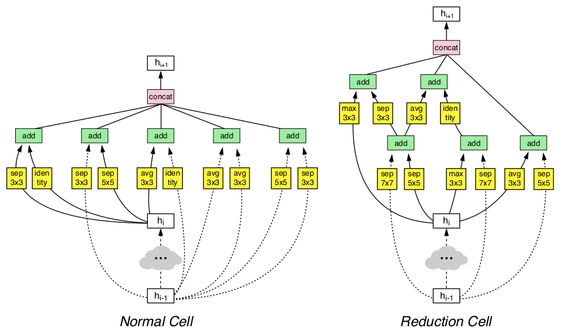
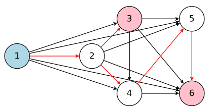
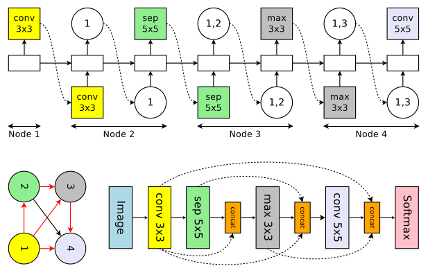
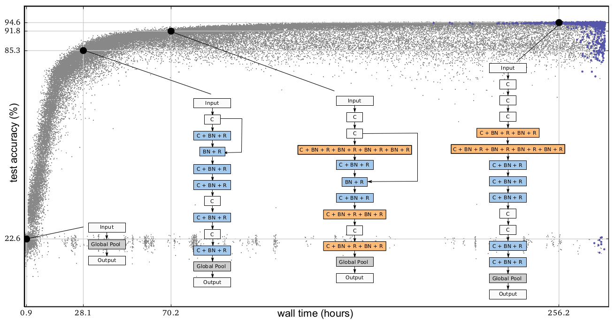
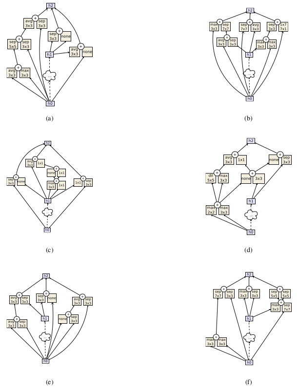

# 神经结构搜索
* [NASNet](#nasnet)(2017.7)
* [ENAS](#enas)(2018.2)
* [Evolution](#evolution)(2017.3)
* [AmoebaNet](#amoebanet)(2018.2)

------
## NASNet
[NASNet1](https://arxiv.org/abs/1611.01578)
利用一个RNN通过强化学习生成了一个效果不错的CNN网络结构或者一个新的Recurrent Cell。
但因为搜索空间太大，最终的效果不算特别明显。  
[NASNet2](https://arxiv.org/abs/1707.07012)
是对前一篇论文的改进, 改成搜索效果最好的Conv cell。
再用这些Conv cell来构建一个更好的网络。
最终在特征提取和目标检测准确率都获得了全方位提升。

### Neural Architecture Search

### Best Convolutional Cells

### 主要创新点
* 自动生成网络结构(Conv Cell): 利用RNN控制器去预测一个网络结构，接着训练这个网络直到收敛，
去验证集上测试得到一个准确率R，然后将这个R作为回报信号反馈给RNN控制器去更新RNN控制器的参数，
从而产生更好的网络结构。
* 有效的网络结构，不一定特别规整。
* 有钱任性(500-800块GPU)
* 要失业了, 要失业了, 要失业了...

[返回顶部](#神经结构搜索)

------
## ENAS
[ENAS](https://arxiv.org/abs/1802.03268)
通过在NAS时子模型间共享权重的方法，克服了NAS类算法计算复杂且耗时的缺陷，
模型搜索时间缩短了1000倍以上。

### DAG 示例

* 节点表示操作
* 边表示信息流
* 红色箭头定义了搜索空间中的一个子模型
* 子模型中，节点1表示输入；节点3和6表示输出。
* 搜索时RNN控制器需要决定激活那些边(或者每个节点的输入)，以及每个节点执行什么操作。

### 搜索示例

### 主要创新点
* NAS的模型搜索空间可以用一个有向无环图(directed acyclic graph, DAG)来进行表示。
* 模型搜索时，子模型间共享权重：借鉴了迁移学习和多任务学习的思想，使搜索时间缩短了1000倍以上。
* 搜索出的RNN模型中只有ReLU和tanh，尽管搜索空间中包含identity和sigmoid。
* micro search space 优于 macro search space ???
* 仅用了一块1080Ti，且训练时间不足一天。
* 真的要失业了, 真的要失业了, 真的要失业了...

[返回顶部](#神经结构搜索)

------
## Evolution
[Evolution](https://arxiv.org/abs/1703.01041)
以空前的规模, 使用简单的进化技术, 从平凡的初始条件出发，
发现了可用于 CIFAR-10 和 CIFAR-100 数据集的模型。

### 演化过程

* 蓝色的是最终存活的, 黑色的已被杀死
* 最右边的是最优个体，左边三个是其祖先
* C表示卷积, BN表示[Batch Norm](#batchnorm), R表示[ReLU](#relu)
    
### 主要创新点
* 演化方法
    * 人群数量: 1000, 竞技场: 250(人口数量的1/4)
    * 竞技场规则
        * 两两竞赛: 比较两者在验证集上的准确率, 优胜劣汰
        * 弱者: 淘汰(killed)
        * 胜者: 获得繁殖的权利, 自我复制得到一个孩子
        * 孩子: 复制自胜者, 基因突变(可能变好, 也可能变差), 长大(训练, 尽可能继承权重)后进入人群
    * 突变方向
        * 改变学习率
        * 不变(keep training)
        * 重置权重
        * 插入或删除卷积层
        * 改变卷积参数(stride, channel_num, kernel_size)
        * 插入或删除恒等连接
* 尽量减少人类的参与:  
    * 从开始进化，到产出一个完全训练的模型，中间不需要人参与。
    * 人类的活动包括：
        * 设计突变方向
        * 调节超参数(人群数量, 迭代次数等)

[返回顶部](#神经结构搜索)

------
## AmoebaNet
[AmoebaNet](https://arxiv.org/abs/1802.01548)
将正则化的进化算法应用到搜索卷积模块上，并与[NASNet2](#nasnet)进行了比较，
证明正则化进化算法优于强化学习(NASNet2)算法。

注: amoeba(变形虫, 阿米巴)是单细胞生物, 最低等的原始生物之一。

### AmoebaNet building blocks

* 搜索空间与NASNet2相同
* 突变修改为随机重新连接输入或随机替换运算
* 没有权重继承，所有的网络模型都需要从头开始训练

### 主要创新点
* 正则化的进化算法: killed最老的而非最弱的
* 搜索block而非搜索整个网络结构
* TPU加速

[返回顶部](#神经结构搜索)
