# Classifier
使用PyTorch实现了经典的深度学习分类算法：  

* [**LeNet**](#lenet)(1998)
* [**AlexNet**](#alexnet)(2012)
    * [ReLU](#relu)
    * [Dropout](#dropout)
* [ZFNet](#zfnet)(2013.11)
* [**VGG**](#vgg)(2014.9)
* [**NIN**](#nin)(2013.12)
* [GoogLeNet](#googlenet)
    * [Inception-V1](#inception1)(2014.9)
    * [**Inception-V2**](#inception2)(2015.2)
        * [BatchNorm](#batchnorm)
    * [**Inception-V3**](#inception3)(2015.12)
    * [Inception-V4](#inception4)(2016.2)
    * [**Xception**](#xception)(2016.10)
* [**ResNet**](#resnet)(2015.12)
    * [**PerActResNet**](#peractresnet)(2016.3)
    * [**ResNeXt**](#resnext)(2016.11)
    * [WRN](#wrn)(2016.5)
* [Stochastic Depth](#stochasticdepth)(2016.3)
* [**DenseNet**](#densenet)(2016.8)
    * [MSDNet](#msdnet)(2017.3)
* [DPN](#dpn)(2017.7)
* [SENet](#senet)(2017.9)
* [NASNet](#nasnet)(2017.7)
* [轻量化网络](#轻量化网络)
    * [**SqueezeNet**](#squeezenet)(2016.2)
    * [**MobileNets**](#mobilenets)(2017.4)
    * [**MobileNet-V2**](#mobilenet_v2)(2018.1)
    * [**ShuffleNet**](#shufflenet)(2017.7)
    * [**CondenseNet**](#condensenet)(2017.11)
* [实验结果](#实验结果)

------
## Requisites:
* anaconda
* pytorch-0.3.0
* torchvision
* visdom

------
分类网络的发展历程参考[这里](https://www.leiphone.com/news/201802/31oWxcSnayBIUJhE.html)
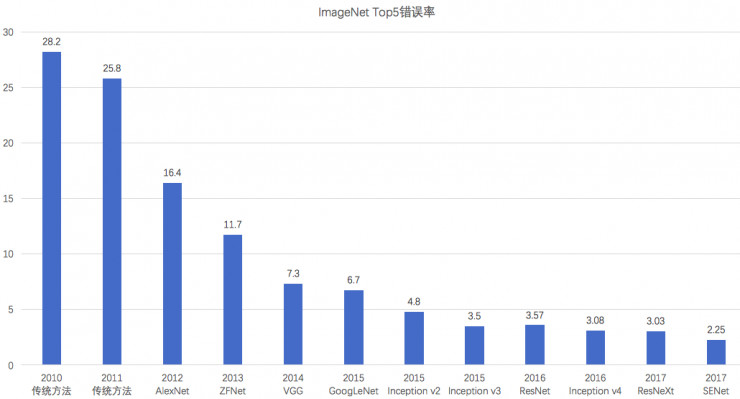

------
## LeNet
[LeNet](http://yann.lecun.com/exdb/publis/pdf/lecun-98.pdf)
是卷积神经网络的开山之作，麻雀虽小但五脏俱全。

### 主要创新点
* 局部感受野(local receptive fields):  
卷积层, 用于提取特征
* 权值共享(shared weights):  
因为目标可能出现在图像的任何位置，所以同一特征图中不同的节点需要在图像的不同位置执行相同的操作。
即，同一层的不同节点拥有相同的权重。该操作使提取的特征拥有了位移不变性，同时大大降低了参数的数量。
* 下采样(sub-sampling):  
pooling层，下采样可以有效的降低输出对尺度和形变的敏感性。
特征图的个数通常随着空间分辨率的降低而增加

#### 卷积

#### max pooling
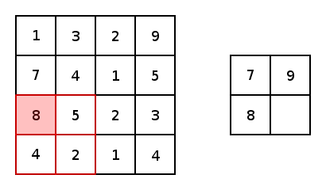

[返回顶部](#classifier)

------
## AlexNet
[AlexNet](https://papers.nips.cc/paper/4824-imagenet-classification-with-deep-convolutional-neural-networks.pdf)
在2012年的ImageNet图像分类竞赛中，top-5错误率比上一年的冠军下降了十个百分点，
且远远超过当年的第二名。将沉寂多年的神经网络重新引入了大众的视野。
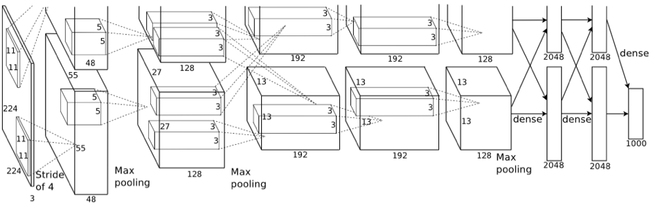
### 主要创新点
* 非线性激活函数: [**ReLU**](#relu)
* 防止过拟合的方法: [Dropout](#dropout), Data augmentation
* 大数据训练: imageNet
* 高性能计算平台: GPU
* 重叠Pooling: kernel_size=3, stride=2
* 局部响应归一化(LRN, Local Response Normalization), 
[VGG](#vgg)说这个没什么用，现在一般使用更强大的[BatchNorm](#batchnorm)代替。

### 本工程实现的AlexNet与原始的AlexNet略有区别
* 没有使用LRN
* 没有使用group

### 训练结果
* 在cifar10数据集上没有达到论文中给出的结果，cifarNet在6个epochs后达到了0.688，
最终达到了0.791  
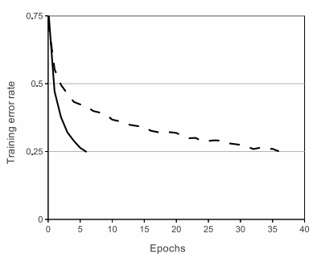

[返回顶部](#classifier)

------
### ReLU
修正线性单元([ReLU](http://proceedings.mlr.press/v15/glorot11a/glorot11a.pdf), Rectified linear unit)
能够有效缓解梯度消失的问题，从而直接以监督的方式训练深度神经网络，无需依赖无监督的逐层预训练。  
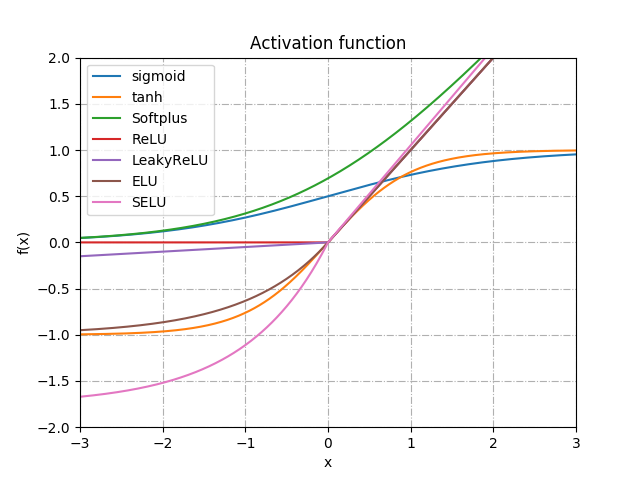

#### 优点
* 收敛速度快:  
sigmoid和tanh的梯度在饱和区域非常平缓，接近于0，很容易造成梯度消失的问题，减缓收敛速度。
而ReLu激活函数的梯度为1，而且只有在x的右半轴才饱和，这样使梯度可以很好的反向传播中传递，
不但提高了网络的训练速度也避免了因为梯度消失导致的网络退化。  
另外，如果涉及到概率问题，如DBN, RNN, LSTM中的一些gate，就不能使用ReLU了，需要使用sigmoid, 
不然，概率表达就错了。
* 稀疏激活性:  
大脑同时被激活的神经元只有4%左右，激活稀疏性匹配了生物学的概念。
早期Bengio教授认为稀疏激活性是网络性能提升的原因之一，
但后来的研究发现稀疏性并非是性能提升的必要条件。
如[PReLU](https://arxiv.org/abs/1502.01852), [ELU](https://arxiv.org/abs/1511.07289)等。

#### 缺点
* 神经元死亡: 随着训练的推进，部分输入会落入硬饱和区，导致对应权重无法更新。
(这个问题可以用[Leaky ReLu](http://ai.stanford.edu/~amaas/papers/relu_hybrid_icml2013_final.pdf)解决)
* 输出偏移: 即输出均值恒大于零。(可以使用[BatchNorm](#batchnorm)进行改善)  
偏移现象和神经元死亡会共同影响网络的收敛性。

[返回顶部](#classifier)

------
## Dropout
[Dropout](https://arxiv.org/abs/1207.0580)
是CNN中防止过拟合，提高模型泛华能力的重要方法之一。
dropout是指在深度学习网络的训练过程中，对于神经网络单元，
按照一定的概率将其**暂时**从网络中丢弃。
对于随机梯度下降来说，每一个mini-batch都是在训练不同的网络。

### dropout有效的原因
1. 集成论  
每次做完dropout，相当于从原始的网络中找到一个更‘瘦’的网络，
因此，对于一个有N个节点的神经网络，使用了dropout后，可以看做是2^n个模型的集合。
2. 噪声论  
使用dropout的网络，在进行训练时，相当于做了数据增强。
因为，总可以找到一个样本，使得在原始的网络上也能达到dropout单元后的效果。

[返回顶部](#classifier)

------
## ZFNet
[ZFNet](https://arxiv.org/abs/1311.2901v3)
是2013年ILSVRC的冠军。其网络结构是在[AlexNet](#alexnet)上进行了微调：
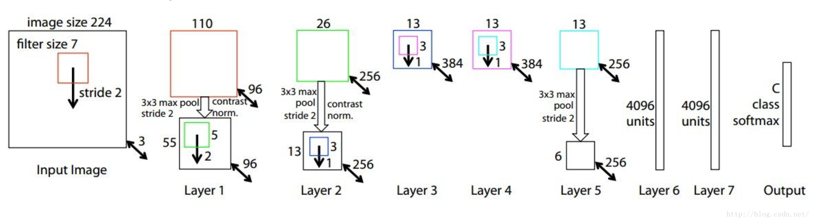
### 主要创新点
* 卷积网络的可视化技术: 反卷积(Deconvolution), 也被称作转置卷积(Transpose convolution)
* 依据可视化的结果，优化了[AlexNet](#alexnet):
    * 第一层卷积的kernel从11改成7; stride从4改称2
    * 去掉了[AlexNet](#alexnet)中的group

#### 卷积与转置卷积
   
图片来自[这里](https://github.com/vdumoulin/conv_arithmetic)

[返回顶部](#classifier)

------
## VGG
[VGG](https://arxiv.org/abs/1409.1556)
在2014年ILSVRC挑战中获得了定位问题的第一和分类问题的第二(第一是[GoogLeNet](#googlenet))。
该模型可以很好的推广到其他数据集上，是最常用的base网络之一。
本工程实现了ABDE 4个网络及其添加了[BatchNorm](#batchnorm)的ABDE网络。

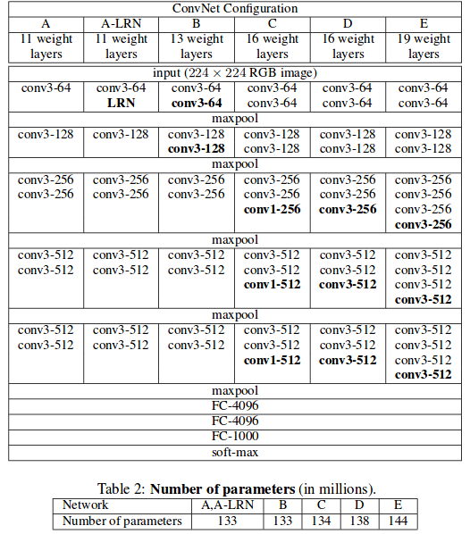

### 主要创新点
* 具有小过滤器的深度网络优于具有较大过滤器的浅层网络
* 使用多种尺度的图像进行训练和测试
* deep, very deep, very very deep

[返回顶部](#classifier)

------
## NIN
[NIN](https://arxiv.org/abs/1312.4400)
对cnn的结构进行了改进。其提出的1*1卷积和全局均值池化已经成为了后来网络设计的标准结构。

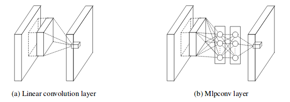

### 主要创新点
* 使用Mlpconv替代卷积：
    * cnn的高层特征其实是低层特征通过某种运算的组合，作者换了个思路，在局部感受野中进行更加复杂的运算。
    * Mlpconv等价于1*1的卷积层。
    * 1*1卷积核可以起到一个跨通道聚合的作用。进一步可以起到降维（或者升维）的作用，起到减少参数的目的
     ([GoogLeNet](#googlenet))。
    * Mlpconv能够提取感受野中的非线性特征，增强了局部模型的表达能力。这样就可以使用均值池化来进行分类。
    
* 使用全局均值池化替代全链接层：
    * 大大降低了参数的数量：原来的cnn参数主要集中在全链接层，特别是与卷积层相连的第一个全链接层。
    * 强化了最后一层特征图与类别的关系：最后一层输出的特征图的空间平均值可以解释为相应类别的置信度。
    * 降低了overfitting：因为均值池化本身就是一种结构性的规则项，且没有参数需要优化。
    使用全链接层的cnn容易过拟合，且严重依赖dropout进行规则化。

[返回顶部](#classifier)

------
## GoogLeNet
GoogLeNet包括V1-V4共四个版本，本工程实现了V2, V3版本。

------
### Inception1
* [Inception V1](https://arxiv.org/abs/1409.4842) 
: Going Deeper with Convolutions [2014.9] [top5: 6.67%]
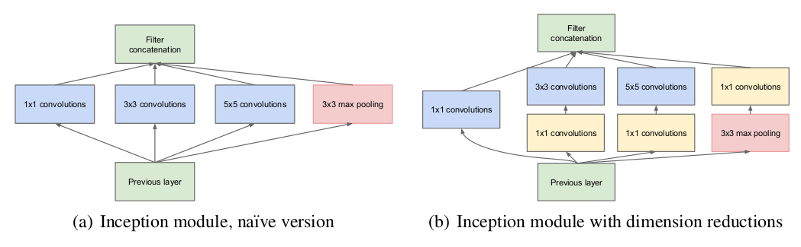

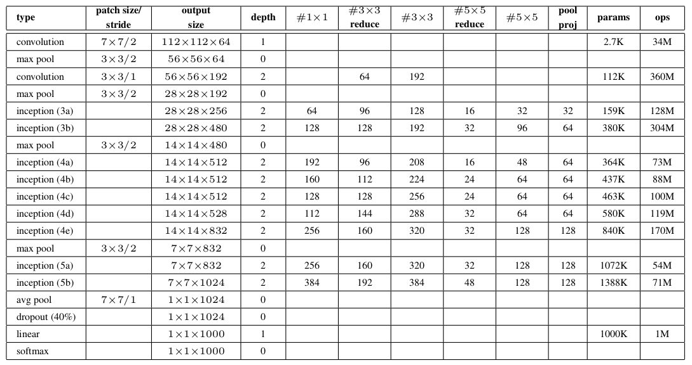
#### 主要创新点
* 提出了Inception， 在利用密集矩阵的高计算性能的基础上，保持了网络结构的稀疏性。
22层网络，参数却只有AlexNet的约1/12。
* 使用不同大小的卷积核提取不同大小感受野的特征，然后对不同尺度的特征进行拼接融合。
* 使用1x1卷积核来进行降维。
* 训练时为了避免梯度消失，增加了辅助分类器用于向前传导梯度（测试时可以忽略，V3中有了新的解释）。

[返回顶部](#classifier)

------
### inception2
* [Inception V2](https://arxiv.org/abs/1502.03167)
: Batch Normalization: Accelerating Deep Network Training by Reducing Internal Covariate Shift
 [2015.2] [top5: 4.8%]
 
 #### 主要创新点
 * 提出了[**BatchNorm**](#batchnorm)
    * 提高SGD中的初始学习率： 加快了学习速度，而不会发生梯度弥散
    * 去掉了Dropout层： BN也可以降低过拟合，去掉dropout可以加快学习速度
    * 减小了L2正则化项： L2正则项也是为了降低过拟合，减小L2正则项可以提高准确率
    * 加快了学习率的衰退速度： 因为BN大大加快了学习速度
    * 去掉了LRN层： 都是Normalization
    * 更彻底地打乱训练样本： why??
    * 减少图像扭曲的使用： epoch数减少，需要多学习真实的数据
 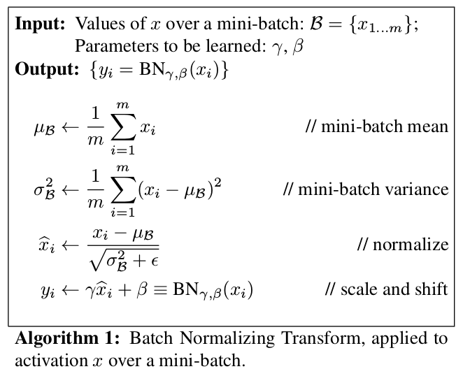
 
 [返回顶部](#classifier)
 
 ------
### BatchNorm
批规范化(Batch Normalization, Inception-V2)通过使深度神经网络训练过程中的每一层神经网络的
输入保持相同分布，解决了反向传播过程中梯度消失(0.9^100 = 2.66 * 10e-5)和
梯度爆炸(1.1^100 = 1.38*10e5)的问题。大大加快了训练的速度，并缓解了过拟合问题。

#### 优点
* 加快了训练速度
    * 解决了梯度消失和梯度爆炸问题
    * 可以在开始训练的时候使用较大的学习率
    * 可以弃用或少用Dropout
* 缓解了过拟合问题
    * 可以弃用或少用Dropout
    * 可以使用比较小的L2正则化项
    * 可以弃用LRN
* 降低了网络对初始化权重的敏感性
* 减小了优化算法参数对结果的影响
* 提高了模型的容纳能力

#### 缺点
* 计算代价：有文章称使用Batch Norm会带来30%的额外计算开销。
* 对浅层网络效果不理想
* RNN、LSTM上效果不理想
* GANs上效果不理想
* 不适合在线学习：mini-batch=1

#### 原因
* 正则化：使用SGD进行训练时，均值和偏差都是在一个Mini-batch上进行计算，
而不是整个数据样集。因此均值和偏差会有一些比较小的噪声。
* 归一化：将输入的特征进行归一化，改变了Cost function的形状，
使得每一次梯度下降都可以更快的接近函数的最小值点，从而加速了模型训练。
* “独立同分布”：Batch Norm限制了前层网络的参数更新对后面网络数值分布程度的影响，
从而使得输入后层的数值变得更加稳定。
* 权重伸缩不变性：避免了反向传播时因为权重过大或过小导致的梯度消失或梯度爆炸问题，
从而加速了神经网络的训练。
* 数据伸缩不变性：数据的伸缩变化不会影响到对该层的权重参数更新，
使得训练过程更加鲁棒，简化了对学习率的选择。

#### 其他规范化方式
参考了[详解深度学习中的Normalization，不只是BN](https://zhuanlan.zhihu.com/p/33173246)
* [Layer Normalization](https://arxiv.org/abs/1607.06450)
综合考虑一层所有维度的输入，计算该层的平均输入值和输入方差，
然后用同一个规范化操作来转换各个维度的输入。
    * LN针对单个训练样本进行，不依赖于其他数据，因此可以避免BN中受mini-batch数据分布影响的问题，
    可以用于小mini-batch场景、动态网络场景和RNN，特别是自然语言处理领域。
    * LN不需要保存mini-batch的均值和方差，节省了额外的存储空间。
* [Weight Normalization](https://arxiv.org/abs/1602.07868)
通过重写网络权重W的方式来进行正则化。
    * 不依赖mini-batch，适用于RNN、LSTM
    * 不基于mini-batch，引入的噪声少于BN
    * WN也不需要保存mini-batch的均值和方差，节省了额外的存储空间
    * WN没有规范化输入，因此需要特别注意网络参数的初始化
* [Cosine Normalization](https://arxiv.org/abs/1702.05870)
通过用余弦计算代替内积计算实现了规范化。
    * 使用余弦代替原来的点积，将数据规范化到[-1,1]
    * CN丢失了scale信息，可能导致表达能力的下降
* [Instance Normalization](https://arxiv.org/abs/1607.08022)
直接的对单幅图像进行的归一化操作，且没有scale和shift。
    * 在图片视频分类等特征提取网络中大多数情况下BN效果优于IN
    * 在超分辨率、生成式类任务中的网络IN优于BN，因为BN破坏了图像原本的对比度信息

[返回顶部](#classifier)

------
### inception3
* [Inception V3](https://arxiv.org/abs/1512.00567)
: Rethinking the Inception Architecture for Computer Vision [2015.12] [top5: 3.5%]  

#### 主要创新点
* 网络设计的通用原则
    * 避免表示瓶颈，尤其是在前面的网络：pooling后特征图变小了，会造成信息丢失。
    * 高维的特征更容易处理，在高维特征上训练更快，更容易收敛。
    * 空间聚合可以通过较低维度嵌入上完成，而不会在表示能力上造成多少损失：
    相邻的神经单元之间具有很强的相关性，信息有冗余。
    * 平衡好网络的宽度与深度
* 将大的卷积拆分成若干个小的卷积：降低计算量的同时增加了空间的多样性。
在每个卷积层后面添加激活函数会比不添加更好。
* 非对称卷积：n\*n的卷积核可以分解成1\*n和n\*1非的卷积核。
在中等大小的feature map中效果比较好。  
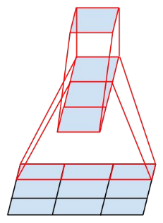
* 优化辅助分类器：辅助分类器起到了正则化(??)的作用，而不是V1中提到的作用。
* 混合poolong：避免了表示瓶颈(representational bottleneck)  
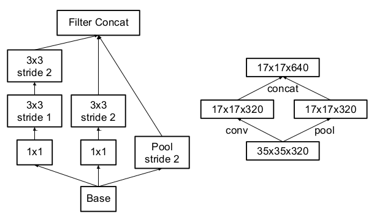
* 标签平滑(Label Smoothing): 对网络输出进行正则化。
* 低分辨率图像的识别；在相同计算量的前提下，
低分辨率的网络需要更长的时间去训练，但最终的结果与高分辨率网络的差别不大。

[返回顶部](#classifier)

------
### inception4
* [Inception V4](https://arxiv.org/abs/1602.07261)
: Inception-v4, Inception-ResNet and the Impact of Residual Connections on Learning
 [2016.2] [top5: 3.08%]
 
 #### 主要创新点
 * 在v3的基础上提出了更复杂(复杂plus plus)的Inception-v4
 * 结合ResNet，提出了Inception-ResNet-v1和Inception-ResNet-v2
 * 残差链接可以加快训练速度，但不使用残差链接也可以训练很深的网络
 * "Although the residual version converges faster, 
 the final accuracy seems to mainly depend on the model size."

[返回顶部](#classifier)

------
### Xception
[Xception](https://arxiv.org/abs/1610.02357v2)
表示Extreme Inception(极致的Inception)。使用深度可分类卷积替换掉了原来的
Inception Module并获得了更好的性能。

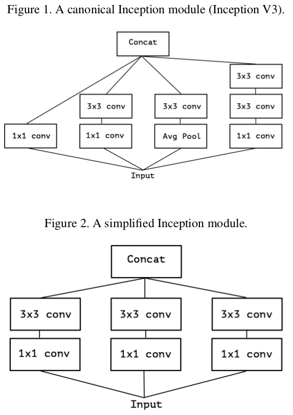
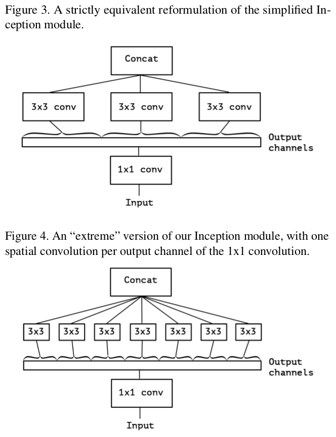
#### 主要创新点
* 深度可分离卷积：在输入的每个通道独立执行空间卷积，然后进行逐点卷积，即1×1卷积，
将深度卷积的通道输出映射到新的通道空间。
* Inception Module是介于普通卷积和深度可分离卷积的中间结构
* 深度可分离卷积之间不使用非线性激活层的效果会更好。

[返回顶部](#classifier)

------
## ResNet
[ResNet](https://arxiv.org/abs/1512.03385)
解决了深层网络训练困难的问题，并在2015年ImageNet的classification、detection、
localization以及COCO的detection和segmentation上均斩获了第一名的成绩，
且获得了CVPR2016的best paper。
ResNet有152层，之后的[改进版](#resnet-v2)
甚至达到了1001层之多。  
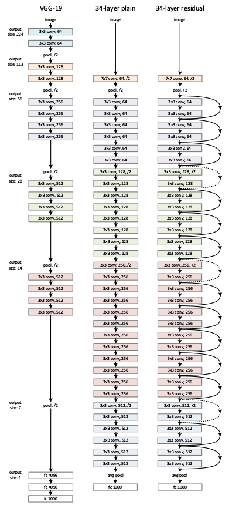
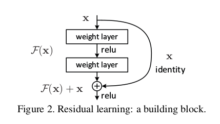

### 主要创新点
* 解决了网络退化问题：随着网络深度的增加，误差趋向于饱和，然后会随之上升。
* 残差网络，恒等映射：如果新添加的层是恒等映射，那么更深层的网络不应该比相应的浅层网络
具有更高的训练误差。
* 加快了训练速度：如果最优的方案等于(近似于)恒等映射，那么将一个残差逼近零
比使用一组堆叠的非线性层来拟合恒等映射要容易的多。

### 集成(ensemble)
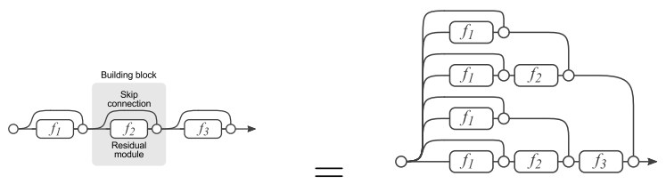  
[残差网络单元可以分解成右图的形式](https://arxiv.org/abs/1605.06431)。
从图中可以看出，残差网络其实是由多种路径组合的一个网络，
换句话说，残差网络其实是很多并行子网络的组合，残差网络其实相当于一个多人投票系统。
删除一个基本的残差单元，对最后的分类结果影响很小。  
[StochasticDepth](#stochasticdepth)表明，训练时也可以随机丢弃掉一些层。  
[ResNeXt](#resnext)中，作者回应说：“But we argue that it is imprecise 
to view our method as ensembling, because the members to be aggregated 
are trained jointly, not independently.”

[返回顶部](#classifier)

------
### PerActResNet
[ResNet-V2](https://arxiv.org/abs/1603.05027)
重新设计了一种残差网络基本单元（预激活），使得网络更易于训练并且泛化性能也得到了提升。
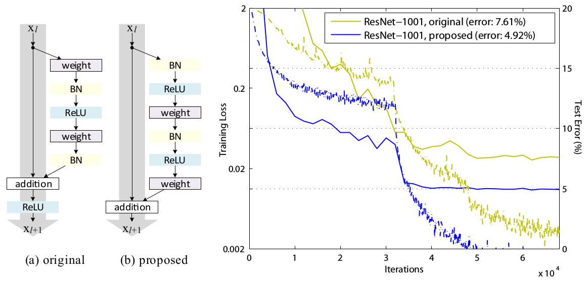

#### 主要创新点
* 深层单元的特征可以由浅层单元的特征和残差函数相加得到。残差网络是连加，普通网络是连乘。
* 任意深层单元的特征都可以由起始特征x0与先前所有残差函数相加得到。
* 回传的梯度不会消失。
* 使用gating或1x1卷积作为快捷链接，其表达能力更强，但是它们的训练误差反而比恒等映射更大，
造成这种结果的原因是优化问题，而不是表达能力的问题。  
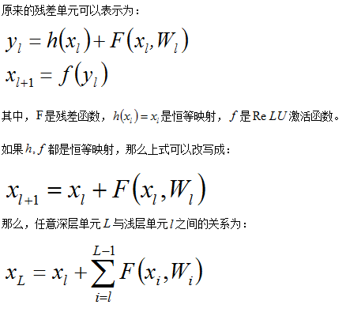

[返回顶部](#classifier)

------
### ResNeXt
[ResNeXt](https://arxiv.org/abs/1611.05431)
引入了一个新的维度——“基数（cardinality）”，即同属一个block变换的数量，
提供了一种新的方式来调整模型容量。这是一个和网络深度、宽度同等重要的因素。

#### ResNeXt Block

#### ResNeXt Block的等价形式
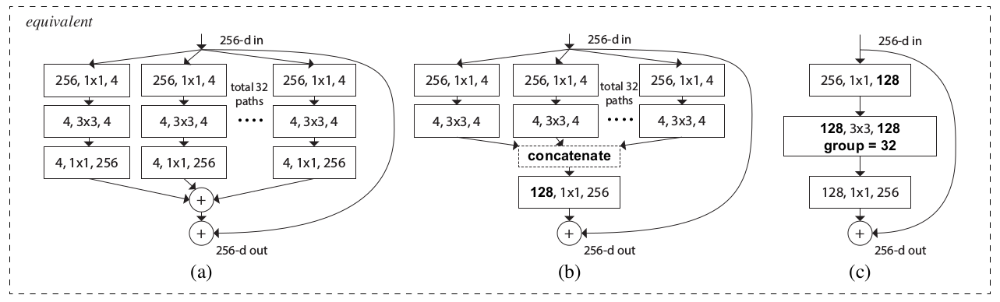
#### 主要创新点
* 提出了一个新的维度——基数, 实验证明通过增大基数来提升网络性能比深度、宽度更有效，
尤其是当深度/宽度的影响开始出现衰减时。
* 重复使用拆分-变换-合并的同结构模块来简明的构建深层网络
* 內积操作可以分为拆分、变换、合并三步，ResNeXt可以看做是恒等链接 + Network-in-Neuron。
* ResNeXt-Blocks可以使用卷积中的group卷积来实现。

[返回顶部](#classifier)

------
### WRN
[WRN](https://arxiv.org/abs/1605.07146)
从“宽度”的角度入手，提出了wide residual networks。作者提供了PyTorch的
[源码](https://github.com/szagoruyko/wide-residual-networks/tree/master/pytorch)

#### 主要创新点
* 增加深度和宽度都有好处
* 相同参数时，宽度比深度更好训练
* ResNet性能的提升主要靠的是参数与计算量，而不是深度！！
* Wide ResNet Blocks中间使用dropout：因为参数太多

[返回顶部](#classifier)

------
## StochasticDepth
[Stochastic Depth](https://arxiv.org/abs/1603.09382)
提出了一种类似于[Dropout](#dropout)的方法来改进[ResNet](#resnet)。
在训练过程中的每一步都随机地「扔掉」（drop）一些层，可以显著的提高ResNet的泛化性能。

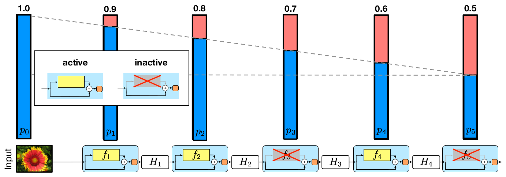

### 主要创新点
* 训练过程中减少了前向传播步骤和梯度计算链，前面的网络可以学到更有用的信息且加快了训练速度
* StochasticDepth可以看做是不同深度网络的集成
* StochasticDepth类似dropout(dropout让网络变瘦，而StochasticDepths让网络变浅)，
可以看做是一种正则化方法，且可以和[batch norm](#batchnorm)结合使用
* 使用StochasticDepth可以训练非常深的网络

[返回顶部](#classifier)

------
## DenseNet
[DenseNet](https://arxiv.org/abs/1608.06993)
是一种具有密集连接的卷积神经网络。在该网络中，任何两层之间都有直接的连接，
也就是说，网络每一层的输入都是前面所有层输出的并集，
而该层所学习的特征图也会被直接传给其后面所有层作为输入。
参考了作者对DenseNet的[解读](http://www.sohu.com/a/161923204_651893)
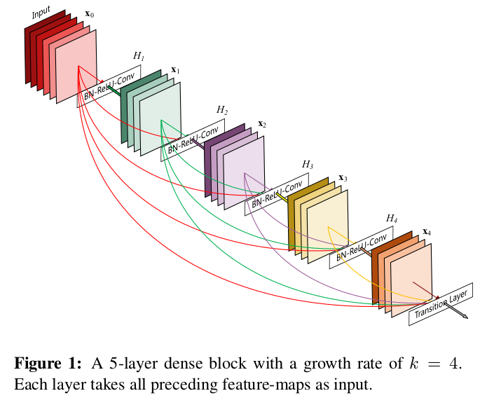
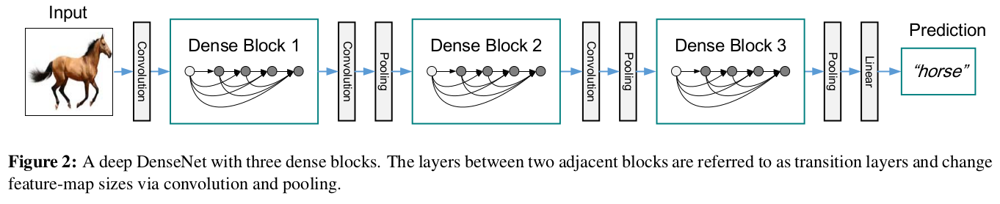

### DenseNet与其他Net的区别
* 网络中的每一层都直接与其前面层相连，从而实现了实现特征的重复利用。
* 同时把网络的每一层设计得特别「窄」，即只学习非常少的特征图，达到降低冗余性的目的。

### DenseNet的优点
* 抗过拟合：参数比较少。
* 信息和梯度传输快捷：每一层都可以直接得到损失函数的梯度以及原始的输入信号，
这有助于训练更深层的网络，使得网络更易于优化。
* 网络效率更高：特征的重复利用，使得DenseNet的每一层只需学习很少的特征，
参数量和计算量显著减少。

### 缺点
* 训练时对显存的消耗：可以通过预先分配内存来优化
* 测试时对内存的消耗：DenseNet需要始终保存所有前面层的输出

[返回顶部](#classifier)

------
### MSDNet
[MSDNet](https://arxiv.org/abs/1703.09844)
是自适应推理的Multi-Scale DenseNet，可以提高深度学习模型的推理效率。
其主要思想是用浅层的特征来预测相对「简单」的图片，用深层的特征来预测比较「难」的图片，
在不损失精度的前提下，有效的降低了深度模型推理时的**平均**计算开销。
作者提供了torch的[源码](https://github.com/gaohuang/MSDNet)  
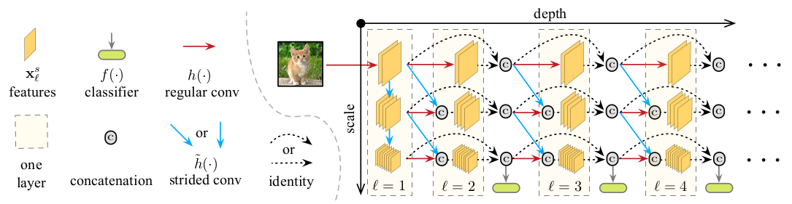
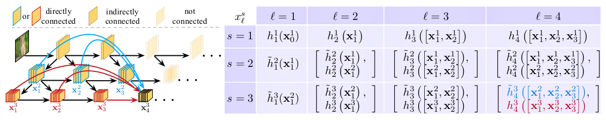

#### 主要创新点
* “级联分类器”：设置一个阈值，当某个分类器的输出超出该阈值时，输出该结果。
不再运行后面的网络。
* 多尺度特征图: 解决前面的分类器中缺少抽象特征(coarse-level features)问题。
* 密集链接: 解决前面的分类器干扰后面分类器的问题。

[返回顶部](#classifier)

------
## DPN
[DPN](https://arxiv.org/abs/1707.01629)
分析了[DenseNet](#densenet)和[ResNet](#resnet)之间的关系及优缺点，
并通过把这两种结构的优点结合到一起，最终提高了准确率和参数利用率。

### HORNN & DenseNet
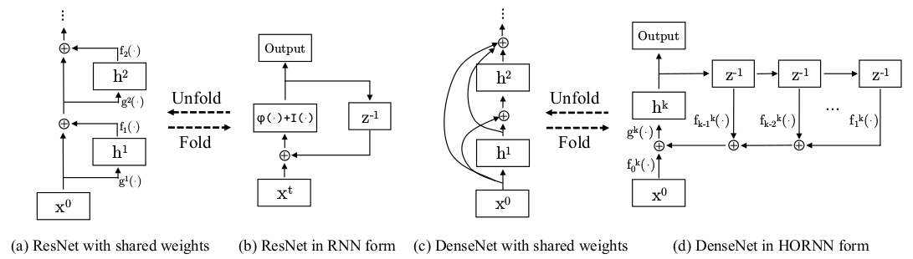

### DPN Architecture
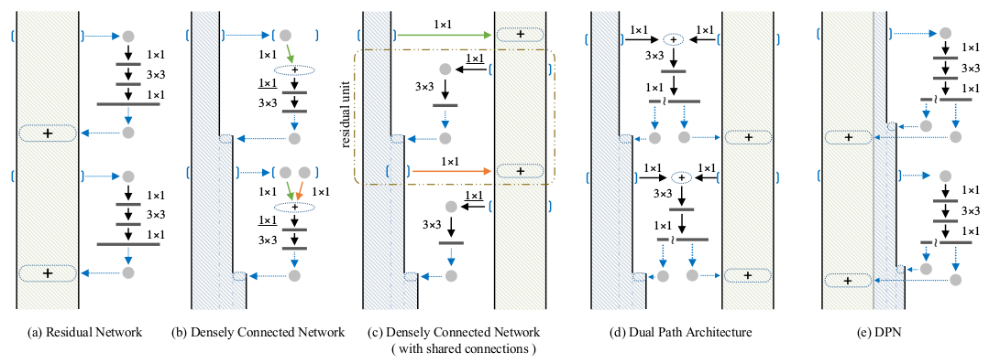

### 主要创新点
* 通过HORNN统一了ResNet和DenseNet的数学表达。
* ResNet通过残差旁支通路再利用特征，但不善于探索新特征；
* DenseNet通过密集连接通路探索新特征，但会产生高冗余度。
* 结合[ResNeXt](#resnext)和DenseNet，提出了一类新的网络拓补结构
DPN(Dual Path Networks)。

[返回顶部](#classifier)

------
## SENet
[SENet](https://arxiv.org/abs/1709.01507)

[返回顶部](#classifier)

------
## NASNet
[NASNet](https://arxiv.org/abs/1707.07012)

[返回顶部](#classifier)

------
## 轻量化网络
------
### SqueezeNet
[SqueezeNet](https://arxiv.org/abs/1602.07360)
使用[AlexNet](#alexnet)1/50的参数，实现了近似的准确率。

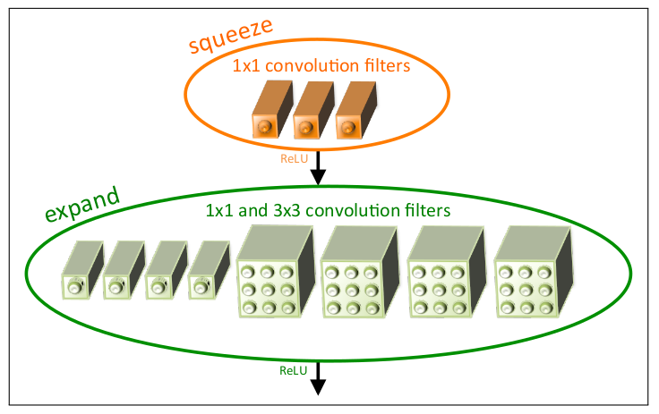  
#### 主要创新点
* Fire Module
    * squeeze层，大幅度减小feature map的数量
    * expand层，使用更小的卷积核：使用1\*1的卷积核替换掉部分3\*3的卷积核
* 推迟降采样：大的feature map有助于提升分类的准确率

[返回顶部](#classifier)

------
### MobileNets
[MobileNets](https://arxiv.org/abs/1704.04861)
基于深度可分离卷积构建了一种轻量化网络。据说本文成果早于[ResNet](#resnet)，故网络结构比较简单。

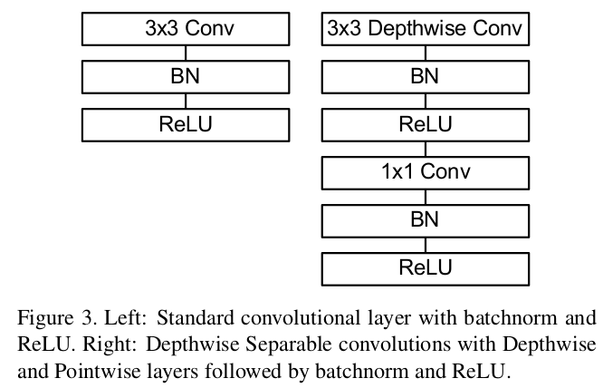
#### 主要创新点
* 利用深度可分离卷积，减少了计算量的同时也降低了参数量
* 将计算和参数的大部分转移到优化做的比较好的1\*1卷积

[返回顶部](#classifier)

------
### MobileNet_V2
[MobileNet_V2](https://arxiv.org/abs/1801.04381)
是对[MobileNets](#mobilenets)的改进，保留了其简单性并显着提高了其准确性。

#### MobileNetV1与V2的微结构对比
* DW之前多了一个1\*1的“扩张”层，目的是提升通道数，以便获得更多特征；
* 为防止Relu破坏特征，使用Linear代替。
  
#### ResNet与MobileNetV2的微结构对比
* ResNet: 压缩 -> 卷积提特征 -> 扩张
* MobileNetV2: 扩张 -> 卷积提特征 -> 压缩

#### 主要创新点
* 线性瓶颈(Linear Bottlenecks): 参考MobileNetV1与V2的微结构对比，
为防止Relu破坏特征，最后一层的ReLu6被替换成了Linear层。
* 倒残差结构(Inverted residuals): 参考ResNet与MobileNetV2的微结构对比，
中间3\*3的卷积层使用更多的通道数，以便获得更多特征。

[返回顶部](#classifier)

------
### ShuffleNet
[ShuffleNet](https://arxiv.org/abs/1707.01083)
利用逐点分组卷积和通道重排技术，在保持准确率的前提下极大地减少计算量。 

#### channel shuffle
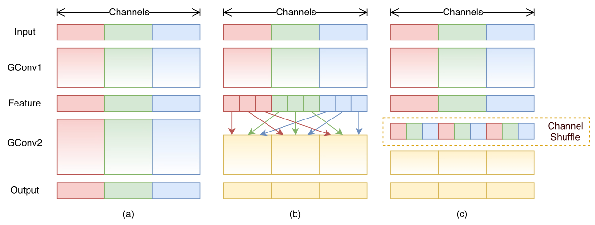
#### ShuffleNet Units
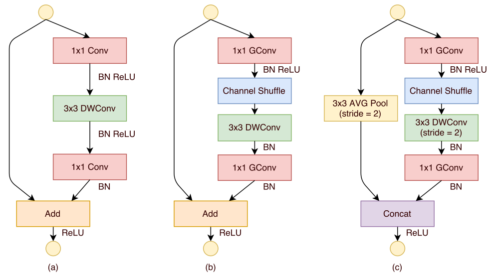

#### 主要创新点
* 分组逐点卷积(pointwise group convolution): 把bottleneck中的1\*1卷积换成分组卷积，
因为在Xception、ResNeXt、MobileNet等模型中，逐点卷积成为了新的计算瓶颈。
* 通道重排(channel shuffle): 引入组间信息交换的机制，以解决分组卷积中信息不流通的问题。
* 修改了bottleneck中stride=2的层(ShuffleNet Units: C)
    * kernel_size 从1改成3
    * sum改成Concat

[返回顶部](#classifier)

------
### CondenseNet
[CondenseNet](https://arxiv.org/abs/1711.09224)
优化了DenseNet网络，通过训练时剪枝以及分组卷积提高了计算效率及参数利用率。作者提供了
pytorch的[源码](#https://github.com/ShichenLiu/CondenseNet)
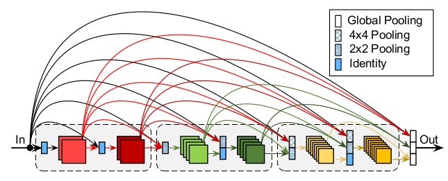
#### 自学习分组卷积

#### 主要创新点
* 自学习分组卷积(Learned Group Convolutions)：
训练时剪枝（稀疏正则化），测试时使用使用分组卷积。
训练和测试时过程参考[LGR](#自学习分组卷积)。
* 完全密集连接：特征图大小不同时，使用average pooling
* 增长率随着特征图变小而指数递增：高层的卷积层更依赖于中高层的特征，较少依赖于底层的特征。

[返回顶部](#classifier)

------
## 实验结果

### imageNet2012验证集(5W)上测试结果
|model|modelSize|times|top1|top5|Params|FLOPS|
|---|---|---|---|---|---|---|
|AlexNet|234M|00|0.565|0.791|61.1M|715.49M|
|Squeezenet_V1.0|4.8M|00|0.581|0.804|1.25M|828.3M|
|SqueezeNet_V1.1|4.8M|00|0.582|0.806|1.24M|354.88M|
|VGG11|507M|00|0.690|0.886|132.86M|7622.65M|
|ResNet18|45M|00|0.698|0.891|11.69M|1818.21M|
|VGG13|508M|00|0.699|0.892|133.05M|11326.85M|
|VGG11_BN|507M|00|0.704|0.898|132.87M|7622.65M|
|VGG13_BN|508M|00|0.716|0.904|133.05M|11326.85M
|VGG16|528M|00|0.716|0.904|138.36M|15489.95M|
|VGG19|549M|00|0.724|0.909|143.67M|19653.05M|
|ResNet34|84M|00|0.733|0.914|21.80M|3669.16M|
|VGG16_BN|528M|00|0.734|0.915|138.37M|15489.95M|
|VGG19_BN|549M|00|0.742|0.918|143.68M|19653.05M|
|DenseNet121|31M|00|0.744|0.920|7.98M|2852.29M|
|DenseNet169|55M|00|0.756|0.928|14.15M|3381.32M|
|ResNet50|98M|00|0.761|0.929|25.56M|4100.70M|
|DenseNet201|78M|00|0.769|0.934|20.01M|4318.56M|
|ResNet101|171M|00|0.774|0.935|44.55M|7818.04M|
|DenseNet161|111M|00|0.771|0.936|28.68M|7761.03M|
|Inception_V3|104M|00|0.779|0.939|
|ResNet152|231M|00|0.783|0.940|60.19M|11536.58M|

更多预训练模型参考[这里](https://github.com/Cadene/pretrained-models.pytorch)  
使用imageNet2012的验证集，预处理为：
1. Resize();
    * Inception_V3: 320
    * other: 256
2. CenterCrop();
    * Inception_V3: 299
    * other: 224
3. Normalize()
    * mean = [0.485, 0.456, 0.406]
    * std  = [0.229, 0.224, 0.225]

------
### cifar数据集上测试结果
|model|params|FLOPs|cifar10|cifar100|备注|
|---|---|---|---|---|---|
|LeNet|244K|00|0.682|0.345|有修改|
|AlexNet|459K|00|0.791|0.373|cifarNet|
|NIN|3.8M|00|0.856|0.592|模型来自caffe|
|VGG13_BN|41M|00|0.878|0.576|有删改|
|GoogLeNet_BN|5.6M|00|0.885|0.623|懒得调参|
|ResNet|19M|00|0.871|0.641|[3, 3, 3]|
|PerAct_ResNet|19M|00|0.866|0.604|[3, 3, 3]|
|ResNeXt|19M|00|0.888|0.653|ResNeXt29_32x4d|
|Xception|2.2M|00|0.863|0.598|改自PerActResNet|
|DenseNet|4.1M|00|0.881|0.623|DenseNet121|
|DPN|00|00|0.|0.|
|SENet|00|00|0.|0.|
|SqueezeNet|2.8M|00|0.792|0.417|SqueezeNet_V1.1|
|MobileNets_V1|4.2M|00|0.842|0.546|有删减|
|MobileNets_V2|3.5M|00|0.867|0.614|有删减|
|ShuffleNet|484K|00|0.773|0.494|模型比较小|
|CondenseNet|00|00|0.|0.|

数据预处理：
1. RandomHorizontalFlip()
2. Normalize()
    * mean = [0.4914, 0.4822, 0.4465]
    * std  = [0.2023, 0.1994, 0.2010]
    
batch size: 128  
优化器：Adam(weight_decay=1e-4)  
损失函数：CrossEntropyLoss()  
迭代次数：50

[返回顶部](#classifier)
